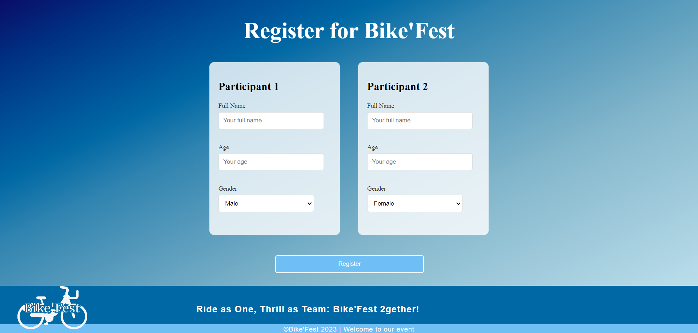

# Bike'Fest Website

Bike'Fest is an annual event hosted at SUP'COM, featuring a captivating duathlon experience for participating teams of couples. As part of this initiative, I took the initiative to craft a dedicated website for the event.

## Technologies Used
- HTML
- CSS

## Features
### Welcome page with a video

### Separation between the welcome page and the other sections

### About the event section

### Previous editions
Hovering a card will give you information about the edition.

### Program

### Organizers

### Contact Page
A form for contact with a map about the localisation of the event

### Footer

### Simple register page

## How to Use
1. Clone the repository.
2. Open the `index.html` file in your web browser.

Feel free to explore the dynamic interface and discover all the exciting details about the Bike'Fest duathlon.
